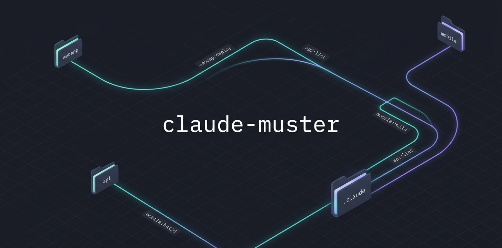

# claude-muster

<p align="center">
  
</p>

[English](./README.md) · [日本語](./README.ja.md) · [中文](./README.zh-CN.md) · [한국어](./README.ko.md) · Español · [Français](./README.fr.md)

**Orquesta cada agente. Desde una sola raíz.**

Trabaja en todos tus repos desde una única sesión de Claude dejando que el Claude propio de cada repo haga su trabajo, en su propia carpeta, con sus skills, agentes, hooks y ajustes intactos.

<p align="center">
  
</p>

<p align="center"><em>Descubre tus repos, despacha una tarea al Claude propio de un repo o reparte la misma a todos, desde una sola raíz.</em></p>

## La situación

Supón que tu trabajo vive en una carpeta llena de repos git independientes:

```
~/work/
├── webapp/    → tiene .claude/skills/deploy, .claude/commands/release
├── api/       → tiene .claude/skills/lint, .claude/agents/db-reviewer, .claude/hooks/pre-commit
└── mobile/    → tiene .claude/commands/build
```

Cada repo lleva su propio `.claude/`: las skills, agentes, comandos, hooks y ajustes que escribió su equipo.

Abre Claude Code **dentro de `api/`** y obtienes todo el instrumental de api. Perfecto. Pero ábrelo **en `~/work/`** para trabajar en los tres a la vez y ese instrumental desaparece, porque Claude Code lee `.claude/` de la carpeta actual y de las carpetas que están por encima, nunca de las que están por debajo.

El arreglo obvio es subirlo todo: copiar o enlazar (symlink) el `.claude/` de cada repo en `~/work/.claude/`. Eso funciona para las skills, pero rompe lo demás en silencio. Un hook escrito para correr dentro de `api/` ahora corre desde `~/work/` con el directorio de trabajo equivocado. Un permiso `deny` de un repo bloquea sin avisar a todos los demás. Dos repos que definen `API_URL` colisionan en un único valor. Los agentes hay que copiarlos, así que quedan desactualizados. Acabas cuidando un `.claude/` fusionado en vez de trabajar.

## Qué hace claude-muster

Toma el enfoque contrario. En lugar de subir el instrumental de cada repo *hacia* una sola sesión, deja el `.claude/` de cada repo exactamente donde está y ejecuta **el Claude propio de ese repo dentro de ese repo**. El Claude de tu raíz se vuelve un orquestador: decide a qué repo pertenece una tarea, se la entrega y lee de vuelta el resultado.

```console
$ cd ~/work
$ claude-muster repos

  3 repos you can dispatch to:

  webapp
  api
  mobile

$ claude-muster dispatch api "arregla el test que falla en handler.ts"

  [api] ok

  Lo encontré: handler.ts llamaba al viejo `parse()` de dos argumentos. Actualicé la llamada y el test pasa.
```

El hijo ejecutó `claude` **dentro de `api/`**, así que tuvo el directorio de trabajo real de api, su entorno, sus skills, agentes, hooks y permisos, exactamente como si tú mismo hubieras abierto Claude ahí. No se copió nada. No se fusionó nada. No hay nada que se desactualice ni que limpiar.

Mejor aún: instala la skill de enrutado y tu Claude raíz aprende a hacerlo por su cuenta:

```console
$ claude-muster install     # añade una pequeña skill a ~/work/.claude/

$ claude
> arregla el test que falla en api y dime cuál es el comando de build de web

  (Claude despacha a api, despacha a web y reporta ambos resultados)
```

¿Quieres que tu Claude raíz conozca sus repos en el instante en que arranca una sesión, sin esperar a que la skill se active? Añade `--hook`:

```console
$ claude-muster install --hook    # registra además un hook SessionStart en ~/work/.claude/settings.json
```

Ahora cada sesión aquí abre con un resumen de una línea de a qué repos puede despachar. Es lo único que claude-muster escribe en tu `settings.json`, y `uninstall` lo retira con exactitud.

Esa es toda la herramienta. **claude-muster nunca llama a un LLM por sí mismo.** `dispatch` lanza tu CLI local `claude`, que corre con tu propia autenticación y tu propia cartera. claude-muster solo decide adónde enviar el trabajo y recoge lo que vuelve.

## Instalación

> **Aún no está en npm.** Por ahora, clónalo y compílalo. Está previsto publicar `npx claude-muster`.

```bash
git clone https://github.com/mk668a/claude-muster
cd claude-muster
npm install && npm run build
npm link            # deja `claude-muster` disponible en todas partes
```

Luego ejecútalo desde la raíz de cualquier workspace:

```bash
cd ~/work
claude-muster repos
```

Node 18+. También necesitas el CLI `claude` en tu `PATH` (es lo que ejecuta `dispatch`).

¿Prefieres no usar `npm link`? Llama directamente al archivo compilado: `node /path/to/claude-muster/dist/cli.js`.

### Eliminar claude-muster de tu máquina

Ojo a la diferencia: `claude-muster uninstall` quita la skill de enrutado de un workspace, **no** la herramienta. Para desinstalar la herramienta en sí, deshaz el `npm link` y borra el clon:

```bash
npm rm -g claude-muster        # o: npm unlink -g claude-muster (deshace `npm link`)
rm -rf /path/to/claude-muster  # la carpeta que clonaste
```

Si te saltaste `npm link` y ejecutabas `node .../dist/cli.js` directamente, basta con borrar el clon.

## Uso

```bash
claude-muster repos                      # lista los repos hijos a los que puedes despachar
claude-muster dispatch <repo> "<task>"   # ejecuta `claude -p "<task>"` dentro de ese repo
claude-muster dispatch --all "<task>"    # reparte la misma tarea a todos los repos
claude-muster install                    # añade la skill de enrutado para que tu Claude raíz delegue
claude-muster install --hook             # informa además a tu Claude raíz sobre sus repos al iniciar la sesión
claude-muster uninstall                  # quita la skill (y cualquier entrada --hook) de esta raíz
claude-muster --version                  # muestra la versión instalada (forma corta: -v)
```

Para deshacer una instalación, ejecuta `claude-muster uninstall` desde la misma raíz en la que instalaste. Quita la skill `muster-dispatch` y, si usaste `--hook`, retira la entrada SessionStart de `settings.json`, borrando el archivo si no queda nada más en él. Solo elimina lo que claude-muster añadió.

Para comprobar qué versión tienes, ejecuta `claude-muster --version` (o `claude-muster -v`).

Flags útiles:

```bash
--root <dir>     # raíz del workspace a escanear (por defecto: directorio actual)
--json           # emite los resultados de dispatch / repos como JSON, para que la sesión padre los parsee
--timeout <ms>   # corta un hijo despachado si tarda demasiado
--depth <n>      # hasta qué profundidad buscar carpetas .claude/ hijas (por defecto: 1)
--path <dir>     # incluye también un repo que viva en otro lugar de esta máquina; repetible
--force          # sobrescribe una skill existente (con `install`)
-v, --version    # muestra la versión
-h, --help       # muestra todos los comandos y flags
```

### Despacha a un repo, o reparte a todos

`dispatch <repo> "<task>"` envía una tarea autocontenida a un repo. Escribe la tarea como se la dirías a un Claude recién abierto en ese repo, porque eso es exactamente lo que es: el hijo arranca sin memoria de tu conversación en la raíz.

`dispatch --all "<task>"` envía la misma tarea a todos los repos en paralelo y recoge los resultados. Está pensado para sondeos y barridos: *"¿cuál es tu comando de test?"*, *"¿hay algún TODO sobre auth en alguna parte?"*, *"sube la versión a 2.0"*. Combínalo con `--json` cuando quieras agregar las respuestas tú mismo.

### Configuración opcional

Por defecto se incluye todo repo hermano que tenga un `.claude/`. Coloca un `claude-muster.json` en la raíz para acotarlo:

```jsonc
{
  "include": ["webapp", "api/*", "services/**"],  // qué repos apuntar (globs, relativos a la raíz)
  "exclude": ["legacy-*"],                          // repos a omitir
  "depth": 2,                                        // cuántas carpetas de profundidad mirar (por defecto: 1)
  "paths": ["../shared-tools", "/abs/path/to/repo"]  // repos extra en cualquier lugar de esta máquina (también: --path)
}
```

## Cómo funciona

Claude Code lee el `.claude/` de cada repo desde la carpeta propia del repo y las carpetas que están por encima. claude-muster nunca pelea contra eso. Solo arranca `claude` con el repo hijo como directorio de trabajo:

| Paso | Qué ocurre |
|---|---|
| **discover** | Recorre la raíz buscando directorios hermanos que contengan un `.claude/` (respetando `claude-muster.json`). |
| **decide** | El Claude de tu raíz (o tú en la línea de comandos) elige a qué repo pertenece una tarea. |
| **dispatch** | Ejecuta `claude -p "<task>" --output-format json` con `cwd` apuntando a ese repo. |
| **collect** | Parsea el resultado final del hijo y se lo devuelve al orquestador. |

Como el hijo es un proceso `claude` real enraizado en su propio repo, todos los problemas que crea el enfoque de copiarlo todo simplemente no aparecen:

- **El directorio de trabajo es el correcto.** Los hooks y scripts corren desde el repo para el que fueron escritos.
- **Sin disparos cruzados.** Los hooks y permisos de cada repo aplican solo a la sesión de ese repo, nunca a los demás.
- **Nada se queda obsoleto.** Los agentes se leen en vivo desde el repo, nunca se copian.
- **Sin colisiones de entorno.** Cada proceso hijo tiene su propio entorno.
- **Nada que limpiar.** Sin symlinks, sin ajustes fusionados, sin manifiesto. `install` añade una skill y `uninstall` la quita.

## Por qué es seguro confiar en ello

- **claude-muster nunca llama a un LLM.** Ejecuta tu CLI local `claude`, con tu autenticación y tu cartera. Sin API keys, sin red propia, sin telemetría.
- **Cambia casi nada en disco.** `dispatch` y `repos` solo leen tus carpetas para descubrir repos. Lo único que llega a escribir es la skill de enrutado de `install`, y `uninstall` la retira.
- **Cada hijo es el de verdad.** Despachar a `api` es lo mismo que abrir Claude en `api/` tú mismo, así que no hay sorpresas sobre qué instrumental está en efecto.

## Qué no hace (todavía)

- **Sesiones hijas persistentes.** Cada `dispatch` es una ejecución `claude -p` fresca y de un solo disparo, así que un hijo no recuerda la tarea anterior que le enviaste. Mantener sesiones cálidas y duraderas por repo es un seguimiento previsto.
- **Repos en otras máquinas.** Funciona cualquier lugar de tu sistema de archivos local (ver `paths`), pero no los repos remotos o en red.
- **Decidir por ti cuando hay ambigüedad.** Si una tarea podría pertenecer a varios repos, el orquestador debería preguntar en vez de adivinar. La skill de enrutado está escrita para hacer justo eso.

## Tu cuenta, tus términos

`dispatch` ejecuta tu propio CLI `claude` instalado localmente bajo tu propia cuenta de Anthropic (una suscripción de Claude o una API key). claude-muster nunca provee, almacena ni comparte credenciales, y usa el modo headless documentado de Claude Code (`claude -p`). Eres responsable de cumplir con los [términos y políticas de uso de Anthropic](https://www.anthropic.com/legal/aup) para tu propio plan.

Una nota práctica: `dispatch --all` arranca varios procesos `claude` a la vez, lo que puede chocar con los límites de tasa de Anthropic si repartes a muchos repos. Mantén la concurrencia en niveles razonables.

## Licencia

MIT.
</content>
</invoke>
